# ✅ ToDo App Full Stack

Aplicación web full stack para la gestión de tareas, desarrollada con **React + TypeScript** en el frontend y **ASP.NET Core Web API + Entity Framework Core + SQL Server** en el backend.

Permite crear, listar, editar, eliminar, buscar, filtrar y marcar tareas como completadas, con una interfaz moderna, notificaciones visuales y arquitectura por capas en el backend.


## 🌍 Demo en vivo
Próximamente

<!-- Cuando hagas deploy puedes reemplazar esto por:
[](AQUI_TU_URL)
-->

---

## 📷 Vista previa

<p align="center">
  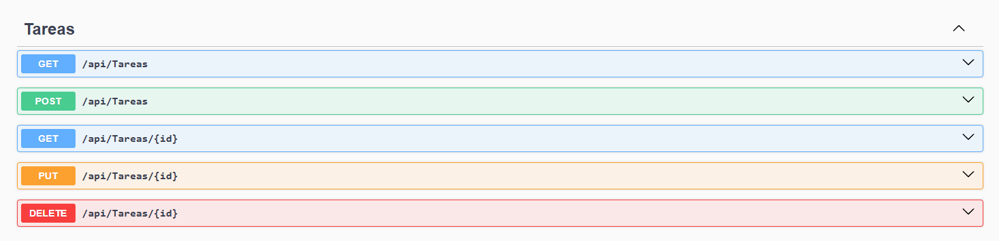
  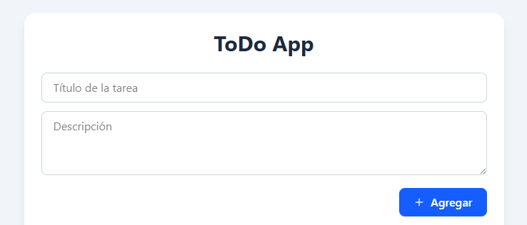
  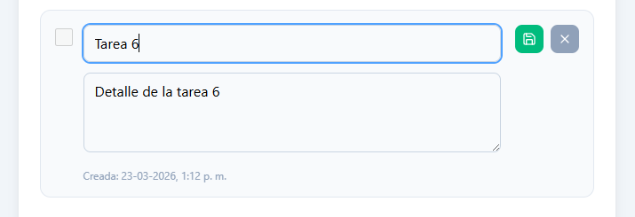
  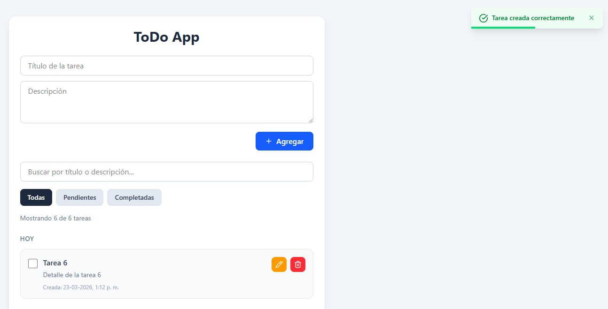
  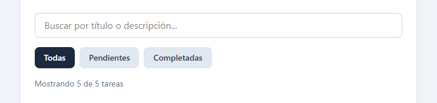
  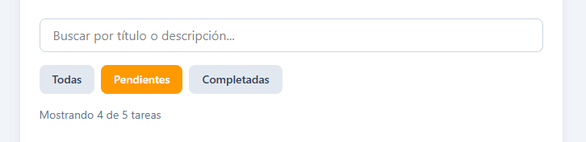
  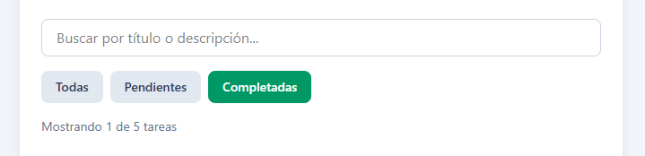
  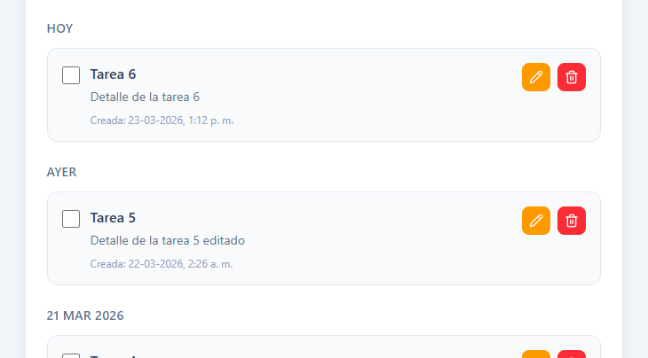
  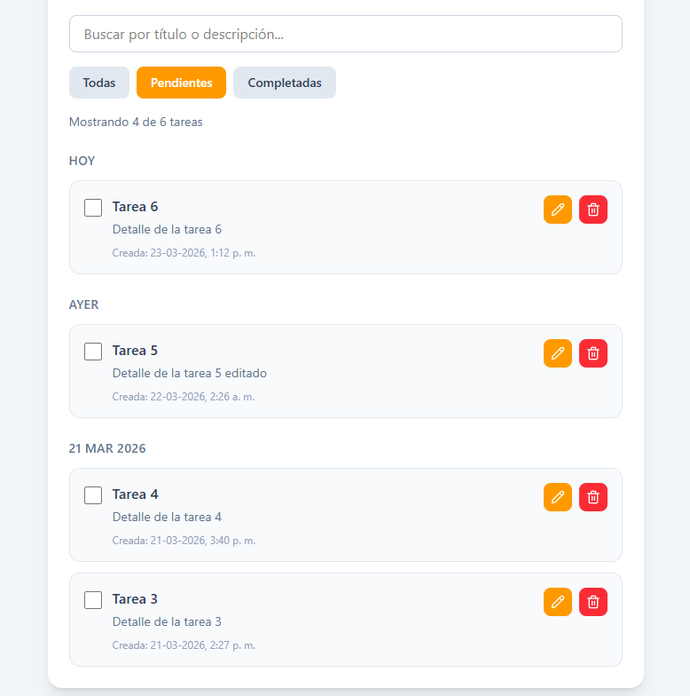
  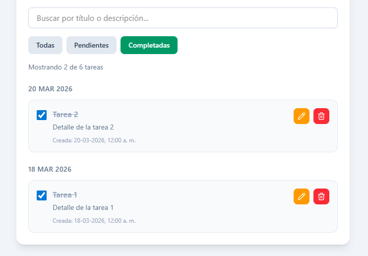
  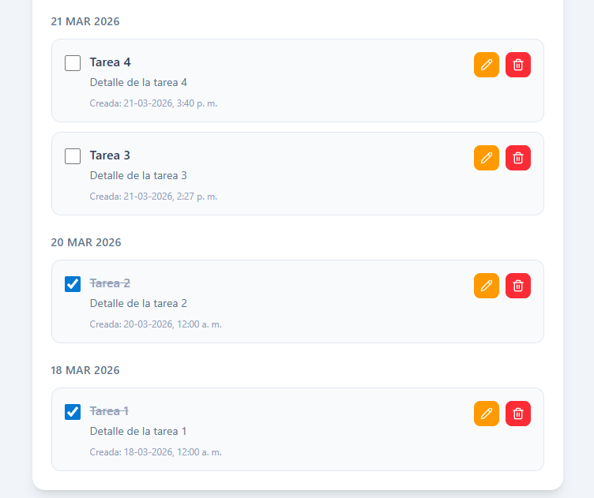
  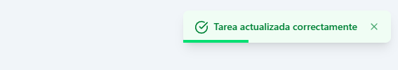
  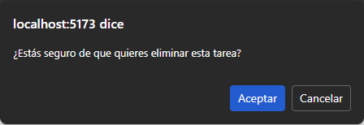
</p>

---

## 🚀 Tecnologías utilizadas

### Frontend
- React
- TypeScript
- Vite
- Tailwind CSS
- Lucide React

### Backend
- ASP.NET Core Web API
- Entity Framework Core
- SQL Server
- Swagger / OpenAPI

### Testing
- xUnit
- Moq

---

## ✨ Funcionalidades

- Crear tareas
- Listar tareas almacenadas en base de datos
- Editar título y descripción
- Eliminar tareas
- Marcar tareas como completadas
- Búsqueda por título o descripción
- Filtro por estado: todas, pendientes y completadas
- Agrupación de tareas por fecha de creación
- Notificaciones tipo toast para éxito y error
- Validaciones en backend
- Arquitectura por capas en API REST
- Pruebas unitarias de servicios

---

## 🧱 Arquitectura del proyecto

El backend fue estructurado siguiendo una separación por responsabilidades:

- **Controllers**: exponen los endpoints HTTP
- **Services**: contienen la lógica de negocio
- **Repositories**: encapsulan acceso a datos
- **Data**: contexto de Entity Framework Core
- **Models**: entidades del dominio

El frontend fue desarrollado con una estructura basada en componentes reutilizables y manejo de estado con React Hooks.

---

## 📂 Estructura del proyecto

```bash
/backend
  /TodoApi
    /Controllers
    /Data
    /Models
    /Repositories
    /Services
    Program.cs
  /ToDoApi.Tests
    /Services

/frontend
  /src
    /api
    /components
    /hooks
    /types
    App.tsx
    main.tsx
```
---

## 🔌 Endpoints principales

- GET /api/tareas → obtener todas las tareas
- GET /api/tareas/{id} → obtener tarea por id
- POST /api/tareas → crear nueva tarea
- PUT /api/tareas/{id} → actualizar tarea
- DELETE /api/tareas/{id} → eliminar tarea

---

## 🧪 Testing

Se implementaron pruebas unitarias para la capa de servicios, validando escenarios como:

- Obtención de tareas
- Creación de tareas válidas e inválidas
- Actualización de tareas
- Eliminación de tareas
- Manejo de excepciones del repositorio
- Validaciones de reglas de negocio

Esto permite asegurar el comportamiento esperado de la lógica antes de llegar al controlador o a la base de datos.

---

## ♿ Accesibilidad y UX

- Labels semánticos en formularios
- Estados de foco visibles
- Toast accesible con aria-live
- Confirmación antes de eliminar tareas
- Feedback visual para acciones exitosas o fallidas

---

## 📌 Mejoras futuras

- Autenticación de usuarios
- Persistencia de filtros por sesión
- Confirmación con modal custom en lugar de window.confirm
- Tests de integración para endpoints
- Deploy completo frontend + backend + base de datos en la nube
- Modo oscuro
- Paginación o virtualización para grandes volúmenes de tareas

---

## 👨‍💻 Autor

Jorge Vargas
