# ✅ ToDo App Full Stack

Aplicación web full stack para la gestión de tareas, desarrollada con **React + TypeScript** en el frontend y **ASP.NET Core Web API + Entity Framework Core + SQL Server** en el backend.

Permite crear, listar, editar, eliminar, buscar, filtrar y marcar tareas como completadas, con una interfaz moderna, notificaciones visuales y arquitectura por capas en el backend.


---

## 📷 Vista previa

### Login
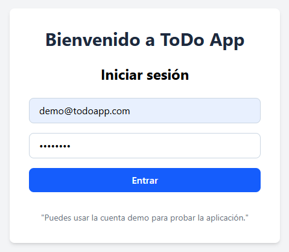

### Header / Create Task Form
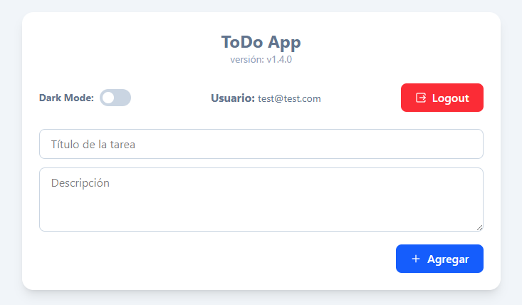

### Task List
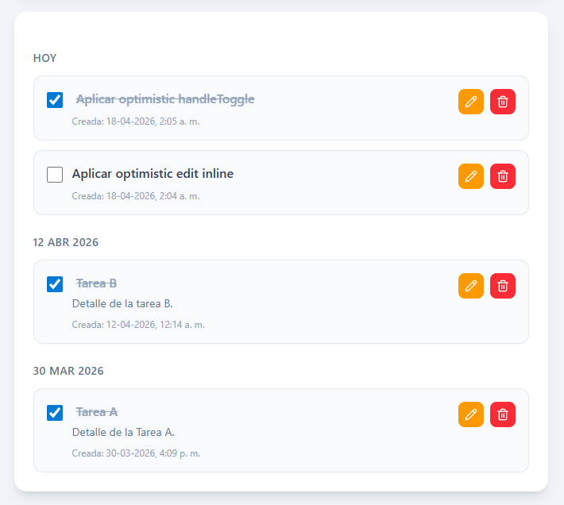
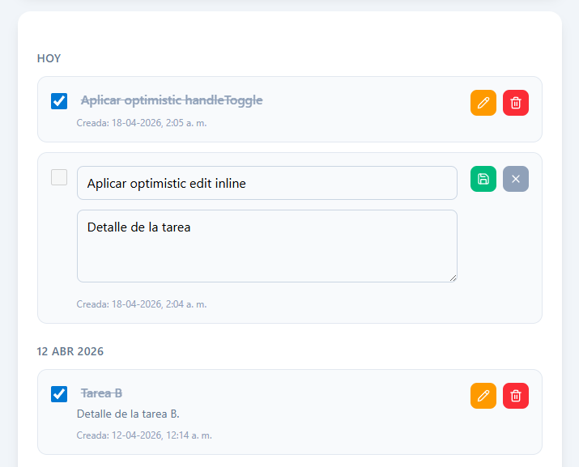
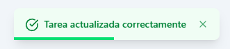
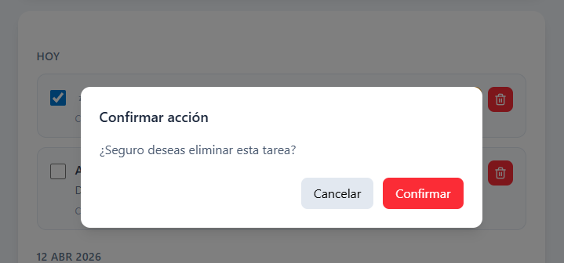

### Filters
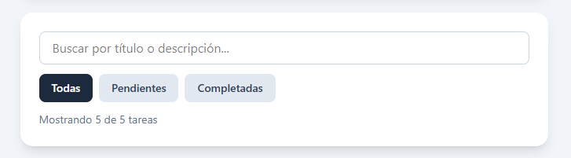
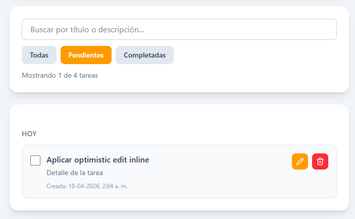
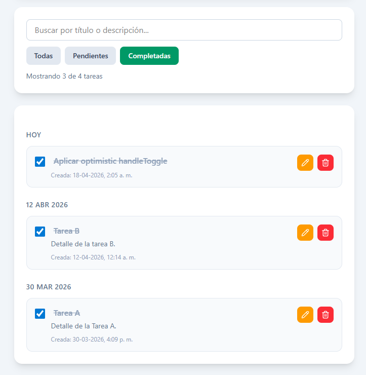

### Dark Mode
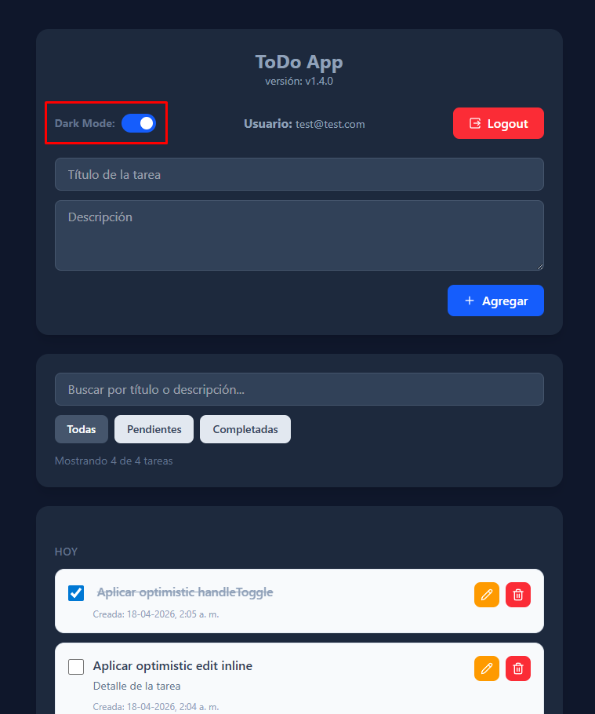

### API Endpoints
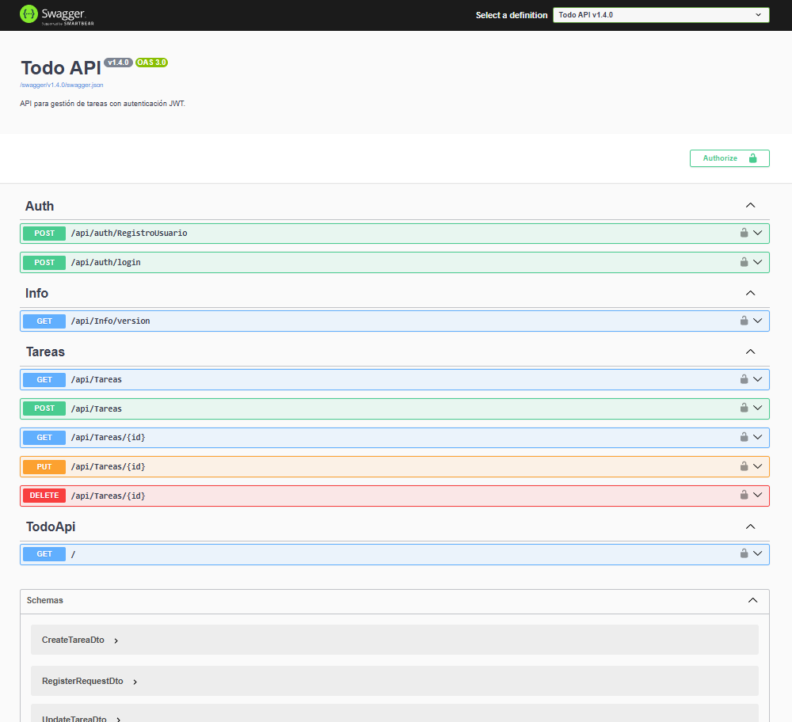

---

## 🚀 Tecnologías utilizadas

### Frontend
- React
- TypeScript
- Vite
- Tailwind CSS
- Lucide React

### Backend
- ASP.NET Core Web API
- Entity Framework Core
- SQL Server
- Swagger / OpenAPI

### Testing
- xUnit
- Moq
- E2E Playwright

---

## ✨ Funcionalidades
- Autenticación con JWT
- Crear tareas
- Listar tareas almacenadas en base de datos
- Editar título y descripción
- Eliminar tareas
- Marcar tareas como completadas
- Búsqueda por título o descripción
- Filtro por estado: todas, pendientes y completadas
- Agrupación de tareas por fecha de creación
- Notificaciones tipo toast para éxito y error
- Protección de rutas
- Logout automático por inactividad
- Interfaz moderna con Tailwind CSS
- Modo oscuro (Dark Mode)
- Validaciones en backend
- Arquitectura por capas en API REST
- Pruebas unitarias de servicios
- Tests E2E (Playwright)

---

## ⚡ Experiencia de Usuario (UX avanzada)
- Skeleton loaders durante la carga de datos (mejora de perceived performance)
- Actualizaciones optimistas (Optimistic UI) en todas las operaciones:
  - Creación instantánea de tareas
  - Edición inline con sincronización automática
  - Eliminación inmediata con rollback en caso de error
  - Toggle de estado (completado) sin latencia visible
- Manejo de rollback ante fallos de API
- Feedback visual de estado optimista (opacidad + bloqueo de interacción)
- Highlight automático al editar tareas (efecto tipo Notion)
- Transiciones suaves y microinteracciones para mejorar la experiencia

---

## 🧱 Arquitectura del proyecto
**Backend (Clean Architecture simplificada)**
- **Controllers** → Exponen endpoints HTTP
- **Services** → Lógica de negocio y reglas
 - **Repositories** → Acceso a datos desacoplado
- **Data** → DbContext (Entity Framework Core)
- **Models** → Entidades del dominio

✔ Separación clara de responsabilidades
✔ Testabilidad mediante mocking (Moq)
✔ Bajo acoplamiento entre capas

**Frontend (Arquitectura por capas + hooks)**
- **api/** → Cliente HTTP centralizado (apiClient)
- **hooks/** → Lógica reutilizable (useTareas, estado y side effects)
- **components/** → Componentes UI desacoplados
- **types/** → Tipado fuerte con TypeScript

✔ Separación de lógica y presentación
✔ Reutilización mediante custom hooks
✔ Manejo manual de estado + side effects

---

## 📂 Estructura del proyecto

```bash
/backend
  /TodoApi
    /Controllers
    /Data
    /Models
    /Repositories
    /Services
    Program.cs

  /TodoApi.Tests
    /Services

/frontend
  /src
    /api          # cliente HTTP (apiClient, endpoints)
    /components   # UI reutilizable (TaskItem, TaskList, etc.)
    /hooks        # lógica de negocio (useTareas)
    /types        # interfaces y modelos TS
    /utils        # helpers (opcional futuro)
    App.tsx
    main.tsx
```
---

## 🔌 Endpoints principales

- GET /api/tareas → obtener todas las tareas
- GET /api/tareas/{id} → obtener tarea por id
- POST /api/tareas → crear nueva tarea
- PUT /api/tareas/{id} → actualizar tarea
- DELETE /api/tareas/{id} → eliminar tarea

---

## ⚙️ Decisiones técnicas
- Implementación de Optimistic UI sin librerías externas (manejo manual de estado y rollback)
- Separación de responsabilidades en frontend mediante custom hooks
- Manejo de errores y estados inconsistentes (prevención de null en render)
- Uso de Skeleton loaders en lugar de spinners para mejorar UX
- Estrategia de sincronización entre frontend y backend sin refetch innecesario
- Uso de storageState en Playwright para optimizar tests E2E
- Arquitectura desacoplada que permite migración futura a herramientas como React Query

---

## 🧪 Testing

Se implementaron pruebas unitarias para la capa de servicios, validando escenarios como:

- Obtención de tareas
- Creación de tareas válidas e inválidas
- Actualización de tareas
- Eliminación de tareas
- Manejo de excepciones del repositorio
- Validaciones de reglas de negocio
- Tests E2E con Playwright (multi-browser: Chromium, Firefox, WebKit)
- Flujos completos: login, CRUD de tareas
- Uso de storageState para evitar login repetido
- Selectores accesibles (getByRole, data-testid)

Esto permite asegurar el comportamiento esperado de la lógica antes de llegar al controlador o a la base de datos.

---

## ♿ Accesibilidad y UX

- Labels semánticos en formularios
- Estados de foco visibles
- Toast accesible con aria-live
- Confirmación antes de eliminar tareas
- Feedback visual para acciones exitosas o fallidas

---

## 📌 Mejoras futuras

- Migración a React Query para manejo de estado server-side
- Undo delete con acción en toast
- Virtualización de listas (react-window / react-virtual)
- Tests de integración backend
- Refresh tokens para autenticación
- WebSockets para actualización en tiempo real

---

## ☁️ Despliegue en la nube (Azure)

Este proyecto fue desplegado completamente en la nube utilizando servicios de Microsoft Azure, separando frontend y backend para una arquitectura moderna y escalable.

## 🔧 Backend
- Desarrollado con .NET 8 + ASP.NET Core
- Desplegado en Azure App Service
- API REST conectada a base de datos en la nube
- Documentación disponible vía Swagger

---

## 🗄️ Base de datos
- Azure SQL Database
- Configuración de firewall para acceso seguro
- Conexión mediante Entity Framework Core

---

## 🎨 Frontend
- Desarrollado con React + Vite
- Desplegado en Azure Static Web Apps
- Integración con backend mediante variables de entorno (VITE_API_URL)

---

## 🔐 Configuraciones clave
CORS configurado en el backend para permitir acceso desde el frontend desplegado
Uso de variables de entorno para separar configuraciones entre desarrollo y producción
Manejo de conexión segura a base de datos mediante connection strings en Azure

---

## 🚀 CI/CD
Integración continua mediante GitHub Actions
Build y despliegue automático del frontend con Azure Static Web Apps
Publicación manual controlada del backend desde VS Code

---

## 🌍 URLs del proyecto
🔗 Frontend: [(URL de Static Web Apps)](https://ashy-desert-0d8175810.1.azurestaticapps.net)
🔗 Backend (API): [(URL de App Service)](https://todolistapi-bzd4bbbpcrbwdah8.brazilsouth-01.azurewebsites.net)
📄 Swagger: [(URL + /swagger)](https://todolistapi-bzd4bbbpcrbwdah8.brazilsouth-01.azurewebsites.net/swagger/index.html)

---

## 🔑 Demo de la aplicación

Puedes probar la aplicación utilizando la siguiente cuenta demo:

Email: demo@todoapp.com
Password: Demo123!

⚠️ Nota: La cuenta demo se reinicia periódicamente, por lo que los datos pueden eliminarse automáticamente.

---

## 🧠 Desafíos y aprendizajes

- Configuración de CORS entre servicios distribuidos
- Manejo de variables de entorno en Vite (build-time)
- Resolución de errores de despliegue en Azure (500.30, CORS, connection issues)
- Separación de frontend y backend en entornos productivos

---

## 👨‍💻 Autor

Jorge Vargas
