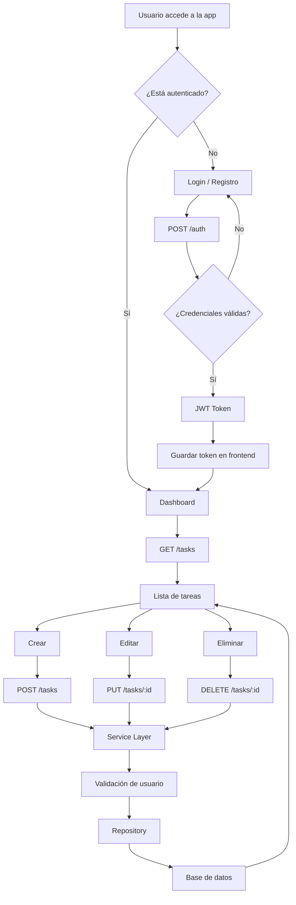

# 📚 Documentación técnica

Esta sección describe el diseño, decisiones técnicas y funcionamiento interno de la aplicación, con foco en arquitectura, seguridad y calidad de código.

---

## 🚀 Contenido

1. Overview del proyecto
2. Arquitectura del sistema
3. Backend (API y capas)
4. Frontend (cliente React)
5. Flujo de datos y autenticación
6. Manejo de estado y Optimistic UI
7. Testing (unitario e integración)
8. Deploy en Azure
9. Decisiones de arquitectura (ADR)

---

## 🧩 Overview del proyecto

Aplicación full stack de gestión de tareas construida con una API RESTful en .NET y un cliente en React.

**Características principales:**

* Autenticación basada en JWT
* Aislamiento de datos por usuario (multi-tenant lógico)
* Arquitectura en capas (Controller / Service / Repository)
* Validación de ownership en operaciones sobre recursos
* Manejo consistente de errores
* Testing automatizado (unitario + integración)

---

## 🏗️ Arquitectura del sistema

La aplicación sigue una arquitectura cliente-servidor con separación clara de responsabilidades:

* **Frontend (React):** manejo de UI, estado y experiencia de usuario
* **Backend (.NET API):** lógica de negocio, autenticación y acceso a datos
* **Base de datos:** persistencia de usuarios y tareas

---

## 🔐 Consideraciones clave de arquitectura

* Cada request autenticada incluye un **JWT**, desde el cual se obtiene el `userId`.
* Todas las operaciones sobre tareas validan que el recurso pertenece al usuario autenticado.
* La lógica de negocio está centralizada en la capa de **Services**, evitando duplicación en Controllers.
* El acceso a datos está encapsulado en **Repositories**, facilitando testeo y mantenimiento.

---

## 🎯 Objetivo de diseño

Este proyecto no busca solo resolver un CRUD, sino demostrar:

* Buenas prácticas en diseño de APIs
* Separación de responsabilidades
* Seguridad a nivel de datos
* Código testeable y mantenible