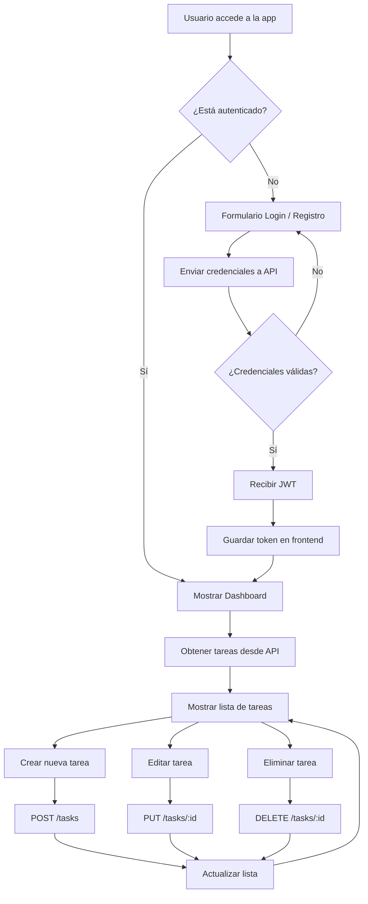

# 📚 Documentación técnica

Esta sección describe en detalle el diseño, decisiones técnicas y funcionamiento interno de la aplicación.

## 🚀 Contenido

1. Overview del proyecto
2. Arquitectura backend
3. Arquitectura frontend
4. Flujo de datos
5. Optimistic UI y UX avanzada
6. Testing
7. Deploy en Azure
8. Lecciones aprendidas
9. Decisiones de arquitectura

---

## 🏗️ Arquitectura del sistema

